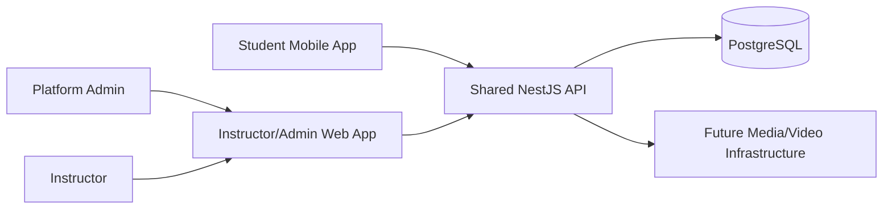

# Architecture

## High-Level Architecture

Edvora is a TypeScript monorepo with three scaffolded applications and a small set of shared packages only when real shared code exists.

```text
apps/mobile  -> Student iOS/Android app
apps/web     -> Instructor and Platform Admin dashboard
apps/api     -> Shared backend API
packages/*   -> Future shared code, added only when justified
```

The repository contains minimal framework scaffolds for these applications. Product features, domain modules, database integration, and infrastructure remain intentionally deferred.

## Planned Stack

- Monorepo: pnpm workspaces
- Student mobile app: React Native + Expo + TypeScript with development/custom build readiness
- Web dashboard: Next.js + TypeScript
- Backend API: NestJS + TypeScript
- Database: PostgreSQL
- ORM: Prisma

Additional infrastructure such as Redis, queues, dedicated caches, third-party analytics, and specialized workers should not be introduced until there is a demonstrated need.

Turborepo is not used at this stage. It may be added later if coordinating multiple real apps/packages becomes meaningfully useful.

## Product Surface Responsibilities

### Mobile

The mobile app is for `STUDENT` users. It should handle student authentication flows, assigned course consumption, quizzes, progress visibility, protected content viewing, device authorization UX, offline/network-aware states where appropriate, and platform-supported native security capabilities.

Mobile must not be trusted as the enforcement layer for security. It may present state and collect inputs, but the backend must enforce authentication, authorization, entitlement, device authorization, and playback authorization.

### Web

The web app serves `INSTRUCTOR` and `PLATFORM_ADMIN` users in one responsive Next.js application. Role-based routing and authorization must separate instructor tenant workflows from platform administration workflows.

Instructor users manage tenant-scoped educational operations. Platform Admin users operate the platform across tenants and handle security-sensitive workflows such as student device-change approvals.

### API

The NestJS API is the shared backend for all product surfaces. It owns server-side business rules, authentication/session handling, authorization, tenant isolation, device authorization, course entitlement checks, security event recording, and playback authorization.

## API-First Communication

Clients communicate with the platform through documented backend APIs. Clients must not directly access database resources or private media origins. Mobile API compatibility matters because users may run older app versions after backend deployment.

## Multi-Tenancy Principles

In V1, a tenant represents an instructor-owned or academy-owned operational boundary. Courses, students, enrollments, content, quizzes, progress, notifications, and most instructor workflows belong to a tenant.

Tenant isolation must be enforced server-side:

- Never trust a tenant ID from the client without checking server-side membership/access.
- Tenant-scoped database records should include a clear tenant boundary.
- Tenant-scoped queries should be applied consistently through repository/service patterns or equivalent backend boundaries.
- Authorization checks should verify both role and tenant membership before returning or mutating tenant data.
- Platform Admin users are not ordinary tenant users. They can perform platform operations across tenants through explicit admin authorization paths.

The model should remain simple enough for early-stage operation and avoid enterprise organization hierarchy overengineering until there is a real need.

## Modular Backend Direction

The backend should be organized around focused modules aligned to product domains, such as authentication, users, tenants, devices, courses, content, quizzes, enrollments, progress, notifications, security events, and platform administration.

Modules should expose clear services and avoid duplicating business logic. Cross-cutting concerns such as authorization, tenant scoping, request IDs, logging policy, validation, and error handling should be handled consistently.

## Scalability Principles

Use scale-ready architecture without scale-expensive infrastructure:

- Keep the API stateless where practical.
- Design for horizontal API scaling.
- Use pagination for lists.
- Plan proper database indexes around query patterns.
- Prevent N+1 query problems.
- Use connection pooling when the database layer is introduced.
- Add rate limiting where abuse or cost exposure exists.
- Use idempotency for retryable operations where relevant.
- Move heavy work to background processing only when the need is demonstrated.
- Upload large media through direct/object-storage-based patterns rather than routing large files through ordinary API memory.
- Deliver video through specialized storage/CDN/video infrastructure rather than making NestJS stream every video byte.

## Avoid Premature Infrastructure

Do not add Redis, queues, Docker, cloud services, analytics SDKs, payment providers, media vendors, or CI/CD before an implementation step proves the need and the decision is documented.

## Simple System View



The media/video provider is intentionally undecided until a dedicated technical and cost evaluation is completed.
