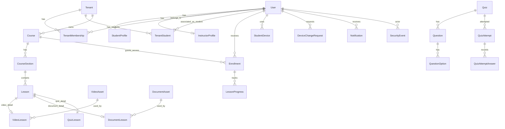

# Database Design

This document proposes the V1 relational schema design for PostgreSQL and later Prisma implementation. It is not a Prisma schema, migration, or implementation.

## ID Strategy

Use UUIDv7-compatible IDs for primary keys where practical.

Reasoning:

- Safer for public API exposure than sequential IDs.
- Time-ordered values improve B-tree index locality compared with random UUIDv4.
- IDs can be generated by the application in distributed contexts.
- PostgreSQL stores them efficiently as `uuid`.
- Prisma can represent them as `String @db.Uuid`; exact UUIDv7 generation can be handled in application code or a reviewed database extension/function later.

Do not expose sequential database IDs publicly.

## Timestamp Strategy

Use timezone-safe UTC timestamps. PostgreSQL columns should use `timestamptz` for business timestamps. Application code should treat stored timestamps as UTC and avoid local-time persistence.

Common fields: `createdAt`, `updatedAt`, optional `deletedAt`, and lifecycle timestamps such as `publishedAt`, `revokedAt`, `completedAt`, and `lastSeenAt`.

## Entity Overview

### Identity and Access

#### User

Canonical account identity.

Fields:

- `id`
- `email`
- `normalizedEmail`
- `emailVerifiedAt`
- `accountStatus`: `ACTIVE`, `SUSPENDED`, `DELETION_REQUESTED`, `DELETED`
- `platformRole`: `STUDENT`, `INSTRUCTOR`, `PLATFORM_ADMIN`
- `preferredLanguage`: `en`, `ar`
- `displayName`
- `createdAt`, `updatedAt`
- `deletionRequestedAt`, `deletedAt`, `anonymizedAt`

Sensitive notes:

- Do not store plaintext passwords.
- Avoid logging email where not needed; use user IDs in logs where possible.
- `normalizedEmail` should be unique for active identities.

#### AuthCredential

Server-side credential ownership concept.

Fields:

- `id`
- `userId`
- `credentialType`: initially `PASSWORD`
- `passwordHash`
- `passwordUpdatedAt`
- `createdAt`, `updatedAt`

Hashing algorithm choice is deferred. No OAuth/social login in V1 design.

#### RefreshSession

Future secure refresh/session handling.

Fields:

- `id`
- `userId`
- `deviceId` nullable
- `status`: `ACTIVE`, `REVOKED`, `EXPIRED`
- `refreshTokenHash`
- `expiresAt`, `revokedAt`, `lastUsedAt`
- `createdAt`, `updatedAt`

Store token hashes, not raw tokens.

#### AccountActivationToken

Single-use account activation token persistence.

Fields:

- `id`
- `userId`
- `tokenHash`: lowercase hexadecimal SHA-256 digest, exactly 64 characters
- `purpose`: `INSTRUCTOR_ACTIVATION` or `STUDENT_ACTIVATION`
- `tenantId` nullable for tenant-initiated onboarding context
- `initiatedByUserId` nullable for Platform Admin/Instructor/support actor context
- `expiresAt`, `consumedAt`, `revokedAt`
- `createdAt`

Store only token hashes, never raw activation tokens. Issuing a replacement activation token should transactionally revoke older outstanding tokens when the workflow requires one outstanding token per user.

#### PasswordResetToken

Single-use password reset token persistence.

Fields:

- `id`
- `userId`
- `tokenHash`: lowercase hexadecimal SHA-256 digest, exactly 64 characters
- `initiatedByUserId` nullable for Platform Admin/support actor context
- `expiresAt`, `consumedAt`, `revokedAt`
- `createdAt`

Store only token hashes, never raw reset tokens. Consuming a reset token, updating credentials, revoking refresh sessions, and recording a security event must be transactional.

#### StudentProfile

Fields:

- `id`
- `userId`
- Optional student display/profile fields
- `createdAt`, `updatedAt`

#### InstructorProfile

Fields:

- `id`
- `userId`
- Optional instructor display/profile fields
- `createdAt`, `updatedAt`

### Tenancy

#### Tenant

Represents an instructor-owned teaching workspace/academy.

Fields:

- `id`
- `name`
- `slug` or short human identifier, if needed
- `status`: `ACTIVE`, `SUSPENDED`, `ARCHIVED`
- `createdAt`, `updatedAt`

#### TenantMembership

Connects users to tenant operator/staff roles. It is intentionally not used for students.

Fields:

- `id`
- `tenantId`
- `userId`
- `role`: `OWNER`, `INSTRUCTOR`, `STAFF`
- `status`: `ACTIVE`, `SUSPENDED`, `REMOVED`
- `createdAt`, `updatedAt`
- `removedAt`

`PLATFORM_ADMIN` users are not modeled as ordinary tenant members for platform-wide power. Students are learners, not tenant operators, so do not add `STUDENT` to `TenantMembershipRole`.

#### TenantStudent

Connects a global `STUDENT` identity to a tenant/academy without granting course access by itself.

Fields:

- `id`
- `tenantId`
- `studentUserId`
- `status`: `ACTIVE`, `INACTIVE`, `REMOVED`
- `createdByUserId` nullable
- `activatedAt` nullable
- `removedAt` nullable
- `createdAt`, `updatedAt`

`TenantStudent` supports instructor student lists, student association before course enrollment, removal without deleting history, and global student identity reuse across multiple tenants. Course access remains modeled through `Enrollment`.

### Devices

#### StudentDevice

Fields:

- `id`
- `studentUserId`
- `clientDeviceIdHash`
- `platform`: `IOS`, `ANDROID`
- `status`: `PENDING`, `APPROVED`, `ACTIVE`, `REVOKED`, `REPLACED`, `BLOCKED`
- `approvedAt`, `activatedAt`, `revokedAt`, `lastSeenAt`
- `appVersion`, `osVersion`, `deviceModel` nullable
- `createdAt`, `updatedAt`

`clientDeviceIdHash` is not an invasive or permanently trustworthy hardware fingerprint. V1 default is one active approved device per student, but limits must be policy/configurable.

#### DeviceChangeRequest

Fields:

- `id`
- `studentUserId`
- `currentDeviceId` nullable
- `requestedDeviceId` nullable until device record exists
- `status`: `PENDING`, `APPROVED`, `REJECTED`, `CANCELED`, `EXPIRED`
- `reason` nullable
- `requestedAt`
- `reviewedByUserId` nullable
- `reviewedAt` nullable
- `reviewNote` nullable
- `createdAt`, `updatedAt`

### Course Content

#### Course

Fields:

- `id`
- `tenantId`
- `createdByUserId`
- `title`
- `description` nullable
- `thumbnailAssetRef` nullable
- `status`: `DRAFT`, `PUBLISHED`, `ARCHIVED`
- `visibility`: `PRIVATE`, `ENROLLED_ONLY`
- `publishedAt`
- `createdAt`, `updatedAt`, `archivedAt`

No pricing, checkout, payment, or marketplace fields.

Course lifecycle is controlled by explicit instructor actions, not by generic metadata updates.
Supported V1 transitions are `DRAFT -> PUBLISHED`, `DRAFT -> ARCHIVED`, and
`PUBLISHED -> ARCHIVED`; `ARCHIVED` is terminal. Course publication does not require published
children and does not publish/archive child sections or lessons as a side effect.

#### CourseSection

Fields:

- `id`
- `tenantId`
- `courseId`
- `title`
- `description` nullable
- `position`
- `status`: `DRAFT`, `PUBLISHED`, `ARCHIVED`
- `createdAt`, `updatedAt`

Section publication and archive use the same explicit lifecycle transition set as Course. Section
publication does not require its parent Course to be published and does not publish/archive child
lessons.

#### Lesson

Generic ordered content item.

Fields:

- `id`
- `tenantId`
- `courseId`
- `sectionId`
- `title`
- `description` nullable
- `type`: `VIDEO`, `DOCUMENT`, `QUIZ`
- `position`
- `status`: `DRAFT`, `PUBLISHED`, `ARCHIVED`
- `availableFrom`, `availableUntil` nullable
- `createdAt`, `updatedAt`

Each lesson has exactly one type-specific detail row matching `type`.

Lesson publication is explicit and requires deliverable content: VIDEO lessons need a tenant-linked
`READY` `VideoAsset`, DOCUMENT lessons need a tenant-linked `READY` `DocumentAsset`, and QUIZ
lessons need a tenant-linked `PUBLISHED` `Quiz`. Lesson archive is non-cascading.

#### VideoAsset

Provider-independent video metadata.

Fields:

- `id`
- `tenantId`
- `uploadedByUserId`
- `externalAssetRef`
- `providerKey` nullable
- `processingStatus`: `UPLOADING`, `PROCESSING`, `READY`, `FAILED`, `ARCHIVED`
- `durationSeconds` nullable
- `failureCode` nullable
- `failureReason` nullable
- `createdAt`, `updatedAt`

No permanent signed playback URLs.

#### VideoLesson

Fields:

- `lessonId`
- `videoAssetId`
- `playbackPolicy`: `STREAM_ONLY`, future values if needed
- `watermarkRequired`

#### DocumentAsset

Fields:

- `id`
- `tenantId`
- `uploadedByUserId`
- `externalAssetRef`
- `fileName`
- `mimeType`
- `fileSizeBytes`
- `processingStatus`: `UPLOADING`, `READY`, `FAILED`, `ARCHIVED`
- `failureReason` nullable
- `createdAt`, `updatedAt`

Do not store PDF binary data in PostgreSQL.

#### DocumentLesson

Fields:

- `lessonId`
- `documentAssetId`
- `viewPolicy`: `IN_APP_ONLY`, `DOWNLOAD_ALLOWED`
- `watermarkRequired`

### Quizzes

#### Quiz

Fields:

- `id`
- `tenantId`
- `title`
- `description` nullable
- `status`: `DRAFT`, `PUBLISHED`, `ARCHIVED`
- `passingScorePercent` nullable
- `attemptLimit` nullable
- `revealAnswersPolicy`: `NEVER`, `AFTER_SUBMISSION`, `AFTER_PASSING`
- `createdAt`, `updatedAt`, `publishedAt`

Quiz lifecycle is explicit. Publishing validates the current active aggregate: at least one
`ACTIVE` question, positive points, valid options, and exactly one correct option per active
question. `ARCHIVED` questions are ignored, matching student delivery and attempt snapshot reads.
Archiving a Quiz does not cascade to QuizLesson rows or attempts; student access is blocked by the
Quiz status gate.

The same aggregate validation is re-run, in the same transaction, after every subsequent Question
create/update and Option create/update while the Quiz is `PUBLISHED`, so a `PUBLISHED` Quiz cannot
be edited into an unpublishable state; a `DRAFT` Quiz is exempt and may remain incomplete during
authoring. Because Question creation always starts a Question with zero Options, creating a new
Question is rejected while its Quiz is `PUBLISHED` rather than briefly persisting an incomplete
`ACTIVE` Question. `publishQuiz()` and every publishability-affecting mutation serialize on one
PostgreSQL transaction-scoped advisory lock keyed on the Quiz ID; Option mutations additionally
keep their pre-existing Question-scoped advisory lock, always acquired after the Quiz-level lock
(Quiz-level → Question-level, never the reverse) to keep lock ordering deadlock-free. No schema or
migration change was required for this.

#### QuizLesson

Fields:

- `lessonId`
- `quizId`

#### Question

Fields:

- `id`
- `tenantId`
- `quizId`
- `type`: `MULTIPLE_CHOICE`, `TRUE_FALSE`
- `prompt`
- `position`
- `points`
- `status`: `ACTIVE`, `ARCHIVED`
- `createdAt`, `updatedAt`

#### QuestionOption

Fields:

- `id`
- `tenantId`
- `questionId`
- `label` nullable
- `text`
- `position`
- `isCorrect`
- `createdAt`, `updatedAt`

For `TRUE_FALSE`, options can still represent true/false choices, keeping answer handling consistent. Correct-answer fields are backend-only and must not be exposed to students before allowed.

#### QuizAttempt

Fields:

- `id`
- `tenantId`
- `quizId`
- `lessonId`
- `studentUserId`
- `enrollmentId`
- `status`: `IN_PROGRESS`, `SUBMITTED`, `GRADED`, `ABANDONED`
- `attemptNumber`
- `clientSubmissionKey` nullable
- `startedAt`, `submittedAt`, `gradedAt`
- `passingScorePercentSnapshot` nullable — the Quiz's `passingScorePercent` frozen at the instant this attempt was created (same datatype/nullability as `Quiz.passingScorePercent`); grading uses this value exclusively, never the live `Quiz` row, so a later instructor threshold change cannot alter an already-started attempt's `passed` outcome
- `scorePoints`
- `maxPoints`
- `passed`
- `createdAt`, `updatedAt`

#### QuizAttemptAnswer

Fields:

- `id`
- `attemptId`
- `questionId` nullable for retained history if question is later archived
- `questionSnapshot`
- `optionsSnapshot`
- `selectedOptionIdsSnapshot`
- `selectedValueSnapshot`
- `correctAnswerSnapshot`
- `pointsAwarded`
- `pointsPossible`
- `createdAt`

Snapshot fields should be bounded JSON structures. They preserve historical integrity without a full generic assessment engine.

### Enrollment and Progress

#### Enrollment

Fields:

- `id`
- `tenantId`
- `courseId`
- `studentUserId`
- `grantedByUserId`
- `status`: `ACTIVE`, `INACTIVE`, `REVOKED`, `EXPIRED`
- `startsAt` nullable
- `endsAt` nullable
- `revokedAt` nullable
- `revokedByUserId` nullable
- `createdAt`, `updatedAt`

No payment fields.

Enrollment keeps `tenantId`, `studentUserId`, and `courseId`, and has a composite relation from `(tenantId, studentUserId)` to `TenantStudent(tenantId, studentUserId)`. This preserves current course/tenant integrity while preventing enrollments for students not associated with the course tenant.

#### LessonProgress

Fields:

- `id`
- `tenantId`
- `courseId`
- `lessonId`
- `studentUserId`
- `enrollmentId`
- `status`: `NOT_STARTED`, `STARTED`, `COMPLETED`
- `startedAt`, `completedAt`, `lastAccessedAt`
- `videoPositionSeconds` nullable
- `videoWatchedSeconds` nullable
- `lastClientMutationId` nullable
- `createdAt`, `updatedAt`

Course progress should generally be derived from lesson progress.

### Notifications

#### Notification

Fields:

- `id`
- `tenantId` nullable for platform-wide notifications
- `recipientUserId`
- `type`
- `category`: `SYSTEM`, `COURSE`, `SECURITY`, `ADMIN`
- `title`
- `body`
- `domainEntityType` nullable
- `domainEntityId` nullable
- `readAt` nullable
- `createdAt`

Provider delivery state can be added later if push/email providers are selected.

### Security Events

#### SecurityEvent

Fields:

- `id`
- `tenantId` nullable
- `actorUserId` nullable
- `targetUserId` nullable
- `deviceId` nullable
- `sessionId` nullable
- `eventType`
- `category`: `AUTHENTICATION`, `AUTHORIZATION`, `DEVICE`, `CONTENT`, `ACCOUNT`, `ADMIN`
- `severity`: `INFO`, `WARN`, `HIGH`, `CRITICAL`
- `requestId` nullable
- `ipHash` nullable
- `userAgentSummary` nullable
- `metadata` bounded JSON
- `createdAt`

Do not store secrets, raw tokens, passwords, or unnecessary PII in metadata.

## Mermaid ER Diagram

## Key Constraints

### Primary and Foreign Keys

- Every table uses UUIDv7-compatible primary key except one-to-one detail tables that may use `lessonId` as primary key.
- Tenant-owned child records must foreign-key to tenant-owned parents.
- `CourseSection.courseId -> Course.id`.
- `Lesson.sectionId -> CourseSection.id` and `Lesson.courseId -> Course.id`.
- `Enrollment.courseId -> Course.id`, `Enrollment.studentUserId -> User.id`.
- `TenantStudent.tenantId -> Tenant.id`, `TenantStudent.studentUserId -> User.id`.
- `Enrollment(tenantId, studentUserId) -> TenantStudent(tenantId, studentUserId)`.
- `LessonProgress.enrollmentId -> Enrollment.id`.

### Uniqueness

- `User.normalizedEmail` unique for active/non-deleted accounts.
- `StudentProfile.userId` unique.
- `InstructorProfile.userId` unique.
- `TenantMembership(tenantId, userId)` unique for active membership, or unique plus status lifecycle if historical rows are kept separately.
- `TenantStudent(tenantId, studentUserId)` unique, using one durable row per tenant/student association with lifecycle status.
- `CourseSection(courseId, position)` unique for non-archived sections.
- `Lesson(sectionId, position)` unique for non-archived lessons.
- `Question(quizId, position)` unique for active questions.
- `QuestionOption(questionId, position)` unique.
- `Enrollment(studentUserId, courseId)` unique for active enrollment.
- `StudentDevice(studentUserId, clientDeviceIdHash)` unique.
- Partial unique index for one active device per student under V1 policy.
- `QuizAttempt(quizId, studentUserId, attemptNumber)` unique.
- `QuizAttempt(studentUserId, quizId, clientSubmissionKey)` unique when client submission key is present.
- `LessonProgress(studentUserId, lessonId, enrollmentId)` unique.

### Check Constraints

Useful future PostgreSQL checks:

- Non-negative `position`.
- Non-negative `points`.
- `passingScorePercent` between 0 and 100.
- `durationSeconds`, `videoPositionSeconds`, and `videoWatchedSeconds` non-negative.
- `startsAt <= endsAt` when both are present.
- Detail-row consistency enforced by application plus relational checks where practical.

## Important Indexes and Query Patterns

- `User(normalizedEmail)` for login/identity lookup.
- `TenantMembership(userId, status)` for resolving instructor tenant access after login.
- `TenantMembership(tenantId, status)` for tenant staff lists.
- `TenantStudent(tenantId, status, createdAt)` for instructor student lists.
- `TenantStudent(studentUserId, status)` for student tenant association and entitlement checks.
- `Course(tenantId, status)` for instructor course management.
- `CourseSection(courseId, position)` for rendering course structure.
- `Lesson(sectionId, position)` and `Lesson(courseId, status)` for course content navigation.
- `Enrollment(studentUserId, status)` for student course list.
- `Enrollment(tenantId, courseId, status)` for instructor student-access management.
- `Enrollment(studentUserId, courseId, status)` for entitlement checks.
- `StudentDevice(studentUserId, status)` for device authorization.
- `DeviceChangeRequest(status, requestedAt)` for Platform Admin review queues.
- `QuizAttempt(studentUserId, quizId, createdAt)` for attempt history.
- `LessonProgress(studentUserId, courseId)` for course progress views.
- `Notification(recipientUserId, readAt, createdAt)` for inbox/unread lists.
- `SecurityEvent(createdAt)` for retention and time-range investigation.
- `SecurityEvent(targetUserId, createdAt)` for support investigations.
- `SecurityEvent(tenantId, createdAt)` for tenant-scoped security review.
- `SecurityEvent(eventType, createdAt)` for abuse/security filtering.

Do not index every column. Add indexes when tied to a real query path.

## Deletion Behavior

Suggested behavior:

- `User` deletion should be status/anonymization based, not blind cascade.
- `AuthCredential`, active sessions, and device authorization can be deleted or revoked during account deletion.
- Profile PII should be deleted or anonymized.
- Enrollments, quiz attempts, and security events may need limited retention with anonymized user references depending on policy.
- Tenant/course/content deletion should usually be archival/status based to protect history and avoid breaking attempts/progress.
- Asset metadata may be archived and later garbage-collected through a separate reviewed storage process.

## Sensitive Data Notes

Never store or expose plaintext passwords, raw access tokens, raw refresh tokens, permanent signed playback URLs, private provider secrets, or invasive hardware fingerprints.

Use hashes for token/session/device identifiers where appropriate. Security event metadata must be bounded and scrubbed.

## Expected High-Volume Tables

Likely high-volume V1 tables:

- `LessonProgress`
- `QuizAttempt`
- `QuizAttemptAnswer`
- `Notification`
- `RefreshSession`
- `StudentDevice`
- `SecurityEvent`

Pagination is required for admin/instructor lists and event review. Security events need retention strategy before production. This schema does not guarantee the design target load by itself; performance depends on query design, indexes, connection pooling, and measured traffic.

## Prisma/PostgreSQL Implementation Considerations

- Use PostgreSQL `uuid` columns with UUIDv7-compatible values.
- Use PostgreSQL `timestamptz`.
- Use enums deliberately; avoid huge enum churn for provider-specific states.
- Prisma may require raw SQL migrations for partial unique indexes and some check constraints.
- Composite unique constraints should be named clearly.
- JSON snapshot fields should be bounded and validated at the application layer.
- Use transactions for lifecycle transitions and reordering.
- Avoid N+1 queries in course structure, progress, and quiz attempt reads.

## Explicitly Deferred From V1

- Applying Prisma migrations and PostgreSQL connection setup.
- OAuth/social login.
- Payment, checkout, subscription, billing portal, marketplace, and pricing fields.
- Advanced organization hierarchy.
- Fine-grained custom permission matrix.
- DRM/video provider choice.
- Push/email/SMS/WhatsApp provider tables.
- Analytics event warehouse.
- Generic assignment/homework engine.
- Advanced quiz/assessment engine.
- Sharding/distributed database design.
